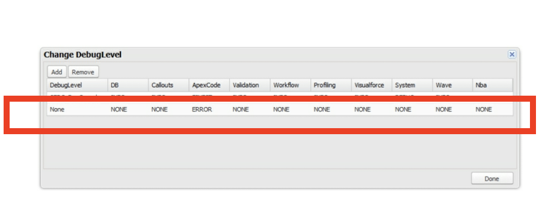

### Dealing with Limits

**SOQL**

Finding SOQL : 101 issue in debug logs can be tricky somtimes as going through logs and finding where the most SOQL are getting consumed.The trick is to make sure that your code is well written: 

1. Always use bulk syntax (see Bulk Patterns later in this chapter).
2. Use before-triggers instead of after-triggers where possible (allows modification of fields without a SOQL query and DML update).
3. Cache query results if your design allows.
4. Include fields from related objects in a single query.

**CPU Time Limits**

1. The amount of CPU time available depends on whether the execution context is taking place during a trigger – a synchronous execution context, or during an asynchronous execution context. Asynchronous execution contexts are allocated considerably more CPU time. 

2. Unlike most limits, CPU time limits are a soft limit. That means that the platform will often allow your code to exceed the CPU time limit if it only happens occasionally, and if the platform has the resources to spare.

3. When the limit is applied, the execution context is terminated. That means that your code just stops running, and most changes made to the database are reverted. There are exceptions: platform events that have already been inserted are not reverted. And at this time, operations performed by declarative processes may not be reverted when this limit is hit.

4. CPU time includes time spent in validation rules, formulas, workflows, processes, and flows, as well as your code and any code belonging to any packages that are installed in the org. 
CPU time limits do not include time spent performing database operations and most queries, or time spent waiting on responses from callouts. However, some aggregate queries do consume CPU time.

5. Move your code to Asynchronous process, if you find yourself running againest CPU limits. Asynchronous operations have, and probably will always have, larger limits than trigger execution contexts.

6. One **common design pattern** is to use a custom field on an object to indicate that an operation is pending, then to query on that flag during a future operation. 

7. Another approach is to use a custom object that you create to hold all of the information needed to perform the future operation, then just query for instances of that object (deleting them after the operation is complete). 

**Benchmarking**
It has always been important to measure the performance of Apex code in order to determine where you should invest the most effort with regards to optimizing your code. With regards to CPU time limits, it is important to know how to measure not just the performance of your code, but also the performance of built-in Salesforce functionality.

Despite this, there are a number of approaches you can use to estimate the performance of a built-in function. All of these approaches are predicated on two facts:

1.  The resolution of the built-in CPU time measurement system is one millisecond.
2. The most accurate results can be obtained by using as much CPU time as possible without exceeding the limit.

The trick is to place the operation you want to measure inside of a loop, perform the operation multiple times, then divide the time spent by the number of iterations.

Check the Apex class and test class from Class folder, for benchmarking.

Note: Set the below debug log, before running the test class.
