### Integration in Salesforce

> [!IMPORTANT]  
This topic is not part of / from Dan Appleman's book Advance Apex Programming. This file is sneak-peak for integration stuff in one place.

Examples/References are taken from Trailhead, ApexHours, Spotify etc.

In this section, we'll see how Integration can be performed in Salesforce. The screenshots and data is taken from Salesforce + Trailhead. Below points are going to be covered

1. Integration Patterns in Salesforce
2. Pattern selection / When to choose whom
3. Scenarios and solutions

**Integration Patterns**

We have many intgration patterns and these patterns are divided into 3 categories. Which are Data Integration, Process Integration and Virtual/UI Integrations.

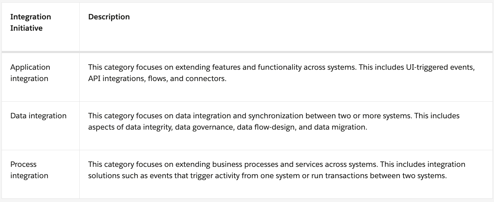

Read More : (https://developer.salesforce.com/docs/atlas.en-us.integration_patterns_and_practices.meta/integration_patterns_and_practices/integ_pat_pat_approach.htm)

Now let's see Integration Patterns as below:

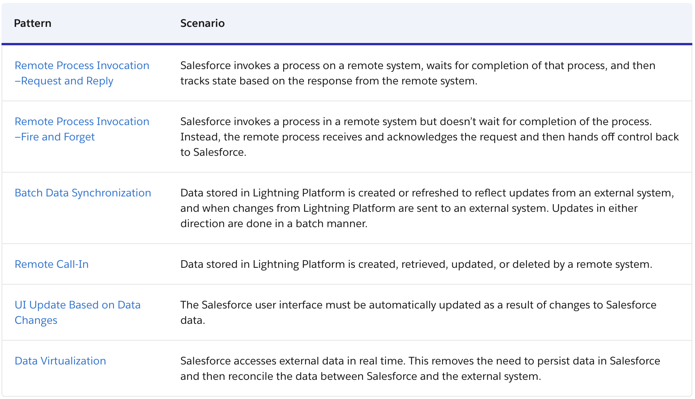

**Pattern Selection**

The matrix for selecting integration pattern is Type (i.e. Type of Integration) and Time (i.e. Synchronous or Asynchronous).

(https://developer.salesforce.com/docs/atlas.en-us.integration_patterns_and_practices.meta/integration_patterns_and_practices/integ_pat_selection_guide.htm)

Apart from above, below image (from Apex Hours) shows what tools you can use to execute integration for a given type.

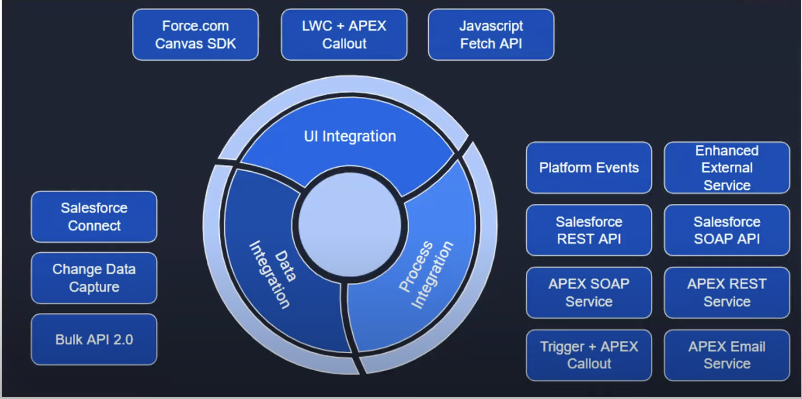

**Scenarions and Solutions**

Now choosing correct integration pattern is not trival, lot of understandings, thought process goes in to select it. Salesforce has already provided document. Where it show scenarios and corresponding solutions

Read More : (https://developer.salesforce.com/docs/atlas.en-us.integration_patterns_and_practices.meta/integration_patterns_and_practices/integ_pat_remote_process_invocation_state.htm)

Additional Reference :
1. Common Salesforce Integration Scenarios and Solutions (https://www.youtube.com/watch?v=p6UsHsNulzc)
2. Salesforce Integration Patterns & Best Practices (https://www.youtube.com/watch?v=2ITAPPQaCig)
3. https://resources.docs.salesforce.com/latest/latest/en-us/sfdc/pdf/integration_patterns_and_practices.pdf

-----

**REST API and SOAP API**

Generally to integration two different system we have an adapter which is called API (Application Programming Interface). We have 2 type of APIs here

REST : Representational State Transfer

SOAP : Simple Object Application Protocol

All the legacy system uses SOAP whereas modern application uses REST API, as this is very lightweight.

**API Tokens, Oauth 2.0 and Grant Types**

#### Authentication & Authorization : 
Authentication is a process to authenticate a user, that is, to verify that someone is who they say they are. Authorization is about determining a user's level of access and then granting access based on that level.

Authentication in REST, can be done by using API Tokens and OAuth 2.0. We have various grant types in OAuth2.0.

Grant types are needed in OAuth 2.0 to determine how an application gets an access token and how it communicates with the OAuth service.

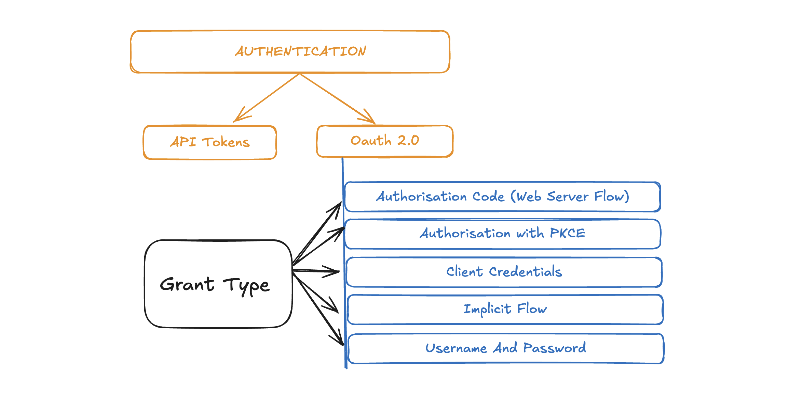

Now understand the different grant types by below link : 

**Grant Type Tutorials** (https://developer.spotify.com/documentation/web-api/tutorials/code-flow)

In the above grant type we need Client Id and Client Secret to heck into the system. Now the question is how to get Client Id and Client Secret?

Let's say we are trying to integrate Salesforce with Spotify. So we need to heck into Spotify. For that we need to create App in Spotify, which eventually will generate Client Id and Client Secret. Using that Client Id and Client Secret in our integration we can bring data from Spotify to Salesforce.

Below is the example:
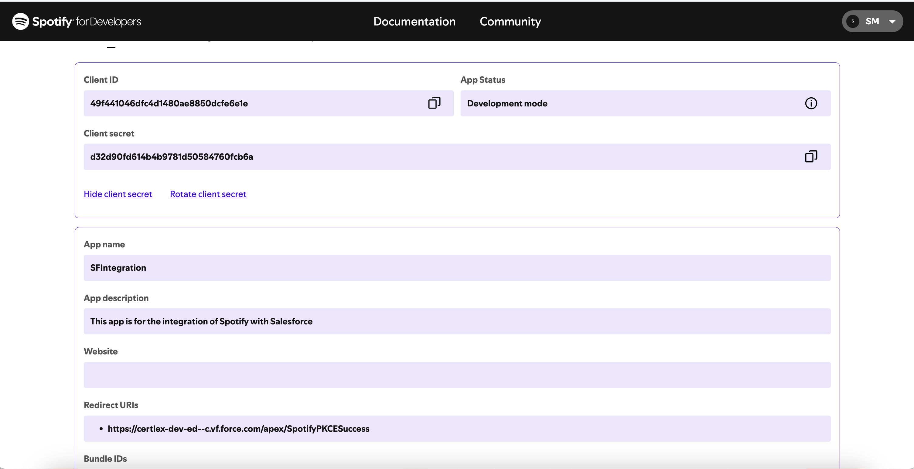

Similary, if we are trying to connect two Salesforce Orgs, then we create Connected App. Generate Client Id and Client Secret that is used by another Salesforce Org to bring in the data.

Below is the example:
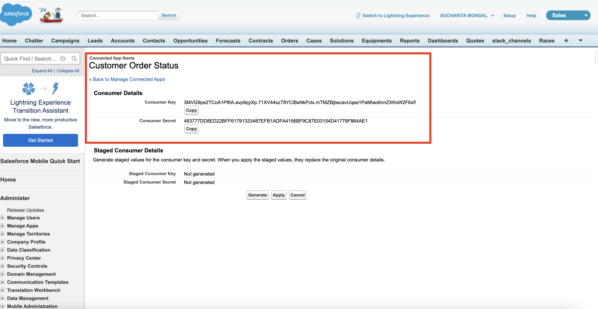

**Access Token**

An OAuth Access Token is a string that the OAuth client uses to make requests to the resource server.
Generally we try to get access token - by using Client Id and Client Secret.
Then make another API call to get data into the system. We have apex snippet later in the document which shows it.

Read More : (https://oauth.net/2/access-tokens/)

-----

**Use of POSTMAN**

POSTMAN is a software application that helps developers build, use, test, document, and share APIs (Application Programming Interfaces). Before putting everything into Apex Classes/Code, we need to test out whether the APIs are working as expected, are we getting the results or not. To test beforehand, we use POSTMAN.

Below is the example:
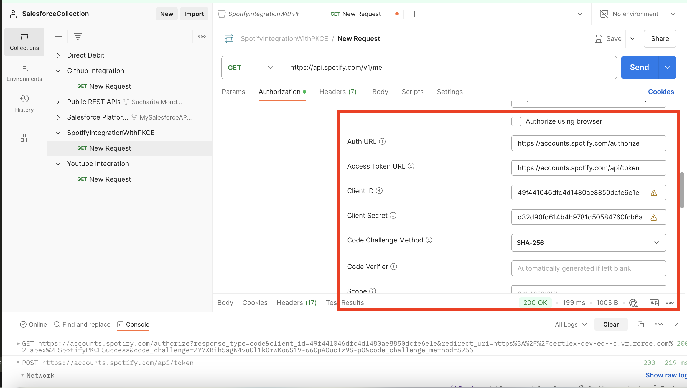

Now see the Apex snippets, to see things in action.

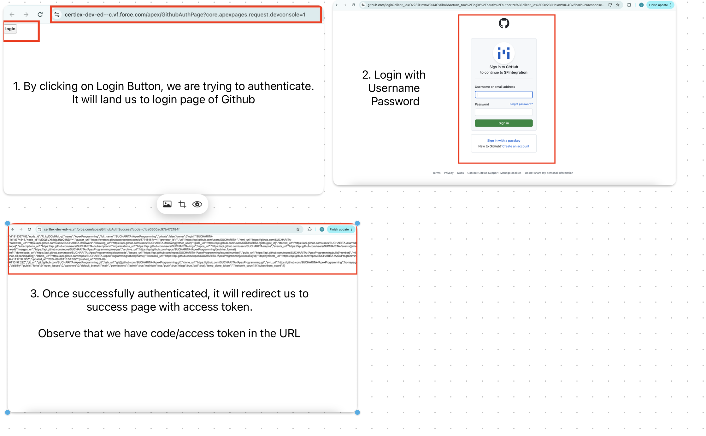

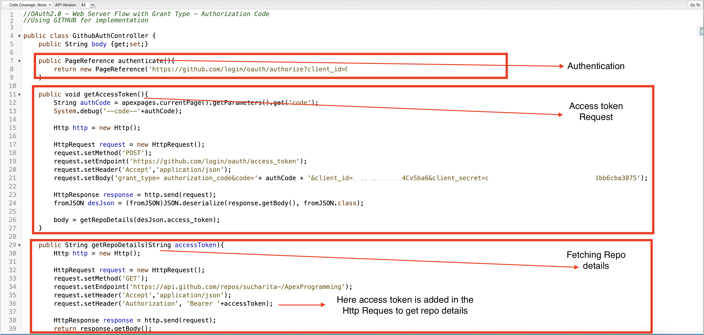

Now one more important thing (which can give you hard time :smile) is the type of response we are getting. It can be XML or JSON.

We need to read through  or De-serialize JSON and fetch the data which we need for further processing or showing it to UI.

Now the question is how to do it ?. Well below is the example of sample JSON and next screenshot show how it's done.

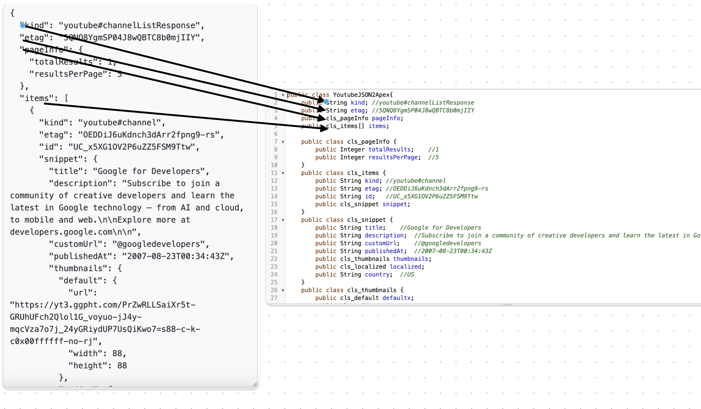

On the left on side, we have sample JSON and right-hand side we have JSON2Apex Class where we are deserializing it.

We can use tools like AdminBooster.com(https://www.adminbooster.com/tool/json2apex) which creates Apex class from JSON Nodes and we can use that class to get desire result. We can understand more about JSON De-serialization with (https://opfocus.com/blog/json-deserialization-techniques-in-salesforce/)

Below example of using JSON Deserialization in Apex Class.
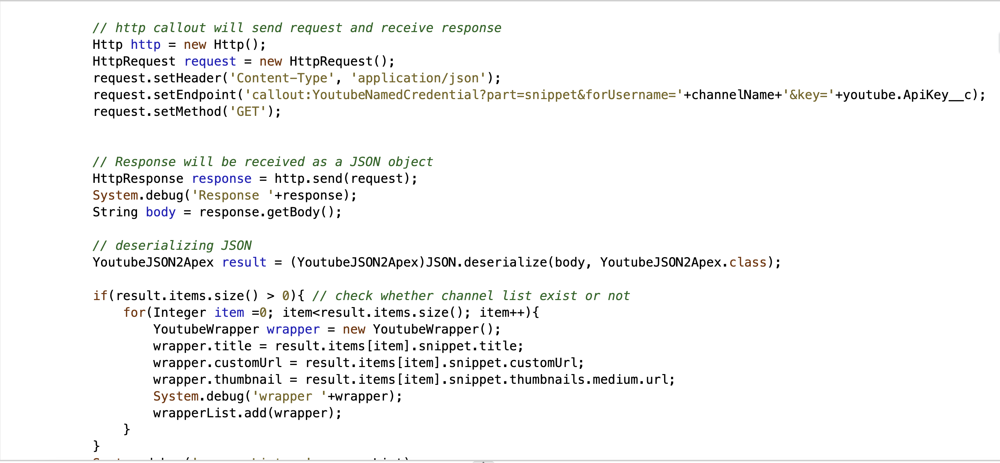